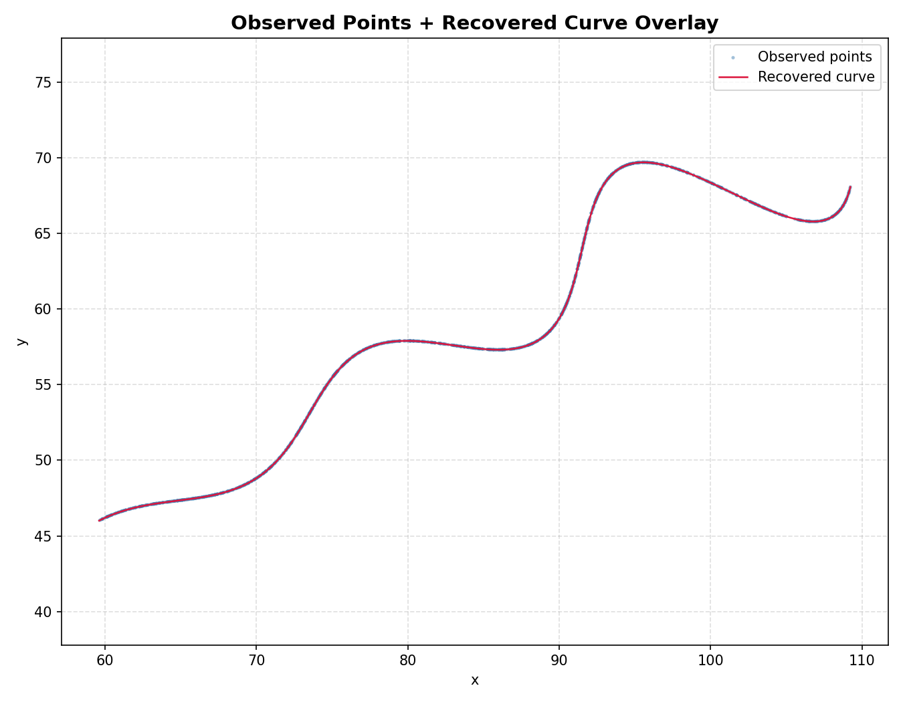

# Parametric Curve Parameter Estimation — Hybrid Differential Evolution + L-BFGS-B

Recovering the unknown parameters `θ` (theta), `M`, and `X` of a parametric curve from a noisy, unordered cloud of observed `(x, y)` points, using a two-stage global-then-local optimization pipeline.



## Problem

The curve is defined parametrically over `t ∈ [6, 60]` as:

```
envelope(t) = exp(M * |t|) * sin(0.3 * t)

x(t) = t * cos(θ) - envelope(t) * sin(θ) + X
y(t) = 42 + t * sin(θ) + envelope(t) * cos(θ)
```

Given `dataset.csv`, a set of 1500 noisy, unordered `(x, y)` samples drawn from this curve, the goal is to recover the underlying `θ`, `M`, and `X` that produced them.

The fit quality is measured as the **mean nearest-neighbor L1 (Manhattan) distance** between each observed point and its closest point on a densely sampled candidate curve, computed efficiently with a `scipy.spatial.cKDTree`.

## Approach

A two-stage hybrid optimization strategy is used:

1. **Differential Evolution (global search)** — explores the full parameter space `θ ∈ [0°, 50°]`, `M ∈ [-0.05, 0.05]`, `X ∈ [0, 100]` to locate the basin containing the global optimum, without getting stuck in local minima.
2. **L-BFGS-B (local refinement)** — starts from the DE solution and polishes it to high precision using gradient-based local search, bounded to the same parameter ranges.

The L-BFGS-B result is only accepted if it improves on (or matches) the DE objective; otherwise the pipeline safely falls back to the DE solution.

Full reasoning, alternative methods considered (grid search, random search, plain gradient descent, genetic algorithms, Bayesian optimization), and the underlying math are written up in [`detailed_report.pdf`](detailed_report.pdf).

## Repository structure

```
.
├── code/
│   ├── main.py           # Full optimization + visualization pipeline
│   └── dataset.csv        # Observed (x, y) point cloud (1500 points)
├── result/
│   ├── curve_comparison_graph.png   # Observed points + recovered curve overlay
│   ├── result.txt                    # Final recovered parameters and error metrics
│   └── requirement.txt               # Python dependencies
└── detailed_report.pdf    # Full write-up: methodology, math, and discussion
```

## Getting started

### Requirements

- Python 3.10+
- numpy >= 1.24
- pandas >= 2.0
- matplotlib >= 3.7
- scipy >= 1.10

### Installation

```bash
git clone <this-repo-url>
cd "flam project"
pip install -r result/requirement.txt
```

### Running

```bash
cd code
python main.py
```

This will:
1. Load and validate the observed points from `dataset.csv`
2. Run the Differential Evolution + L-BFGS-B optimization pipeline
3. Compute nearest-neighbor error metrics (L1, Euclidean, RMSE, MAE, std)
4. Display seven diagnostic plots (observed points, recovered curve, overlay, residual histogram, residual scatter, zoomed overlay, DE-vs-refined comparison)
5. Print a full final report to the console

## Results

| Parameter | Recovered value |
|---|---|
| θ (degrees) | 29.999988 |
| θ (radians) | 0.523599 |
| M | 0.030001 |
| X | 55.000003 |

| Metric | Value |
|---|---|
| Mean L1 distance | 0.000428 |
| Median L1 distance | 0.000429 |
| Maximum L1 distance | 0.001253 |

The recovered curve overlays almost exactly onto the observed points (see plot above), confirming a high-quality fit.

## Author

**Chanchlesh Suryawanshi**
M.Tech, Data Science Engineering — National Institute of Technology, Jamshedpur
